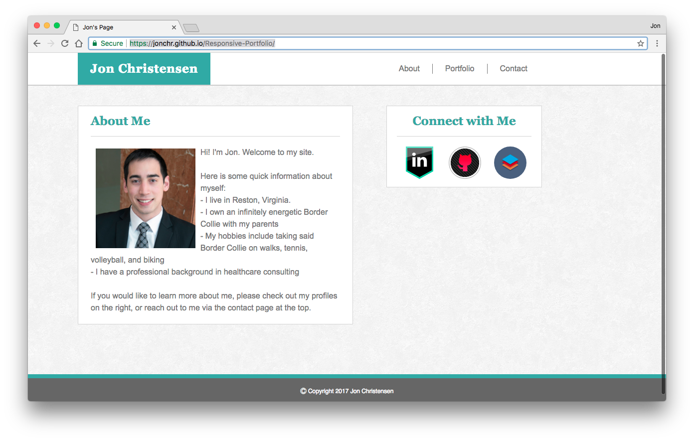

# Responsive-Portfolio
This is a resposive version of my original website built solely using HTML5 and CSS3. A live version can be viewed at https://jonchr.github.io/Responsive-Portfolio

## Description

Similar to the [previous version](https://github.com/jonchr/Basic-Portfolio), this site contains three pages: a main About Me page, a portfolio page, and a contact me page.

	About Me - offers brief information about myself
	Portfolio - displays pictures of my dog, Annabelle, since I did not yet have many projects to show
	Contact Me - contains a form that opens a new email in your default mail app

Each page contains a header with links to all pages at the top, a section on the right with links to my LinkedIn, Github, and StackOverflow profiles, and a sticky footer.

### Development

This site was developed as part of the GW Coding Bootcamp and was at the end of the first week. Each page was built using HTML5 and CSS3.

This is a responsive design version of my first personal page. To view that version of this page, please see the repo at https://github.com/jonchr/Basic-Portfolio.

To view the version of this site that uses Bootstrap, please see the repo at https://github.com/jonchr/Bootstrap-Portfolio.

This page uses the Meyerweb Reset CSS file v2.0 available to the public domain at http://meyerweb.com/eric/tools/css/reset/

The background image for this page is **Redox 01** and was used with permission from https://www.toptal.com/designers/subtlepatterns/redox-01/

## Screenshots
### Main/About Page

